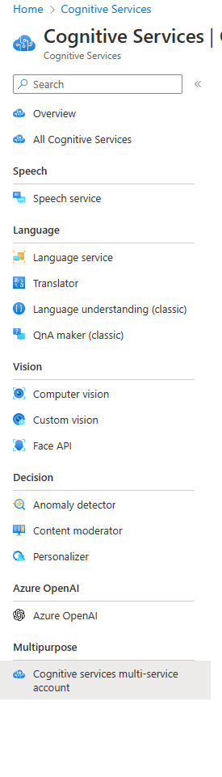
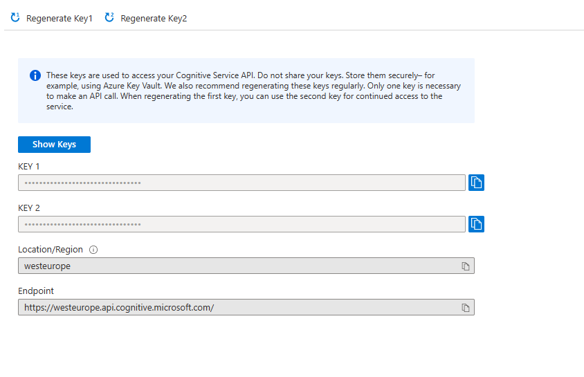

# Some samples for getting started with MS Cognitive services

### Configure your environment

- Install .NET Core 6
- Create a azure account
- Setup a free tier of Cognitive services multi-service tenant account (That way you have access to everything via one token)
- Copy the OCP APIM subscription key
- Create an environment variable called `AZURE_COGNITIVE_TOKEN`
- Paste in the value for your subscription key.
- Create an environment variable called `AZURE_COGNITIVE_ENDPOINT`
- Paste in your region endpoint. eg: https://westeurope.api.cognitive.microsoft.com/
- CD into any of the projects and do `dotnet run`

Have fun!

